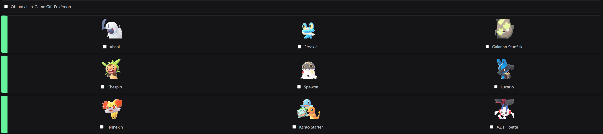
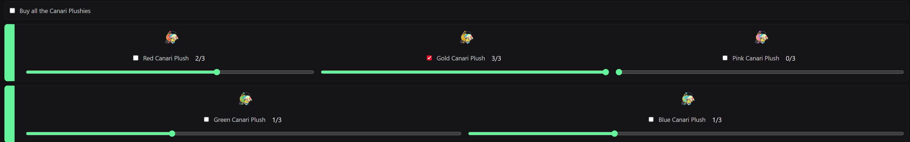
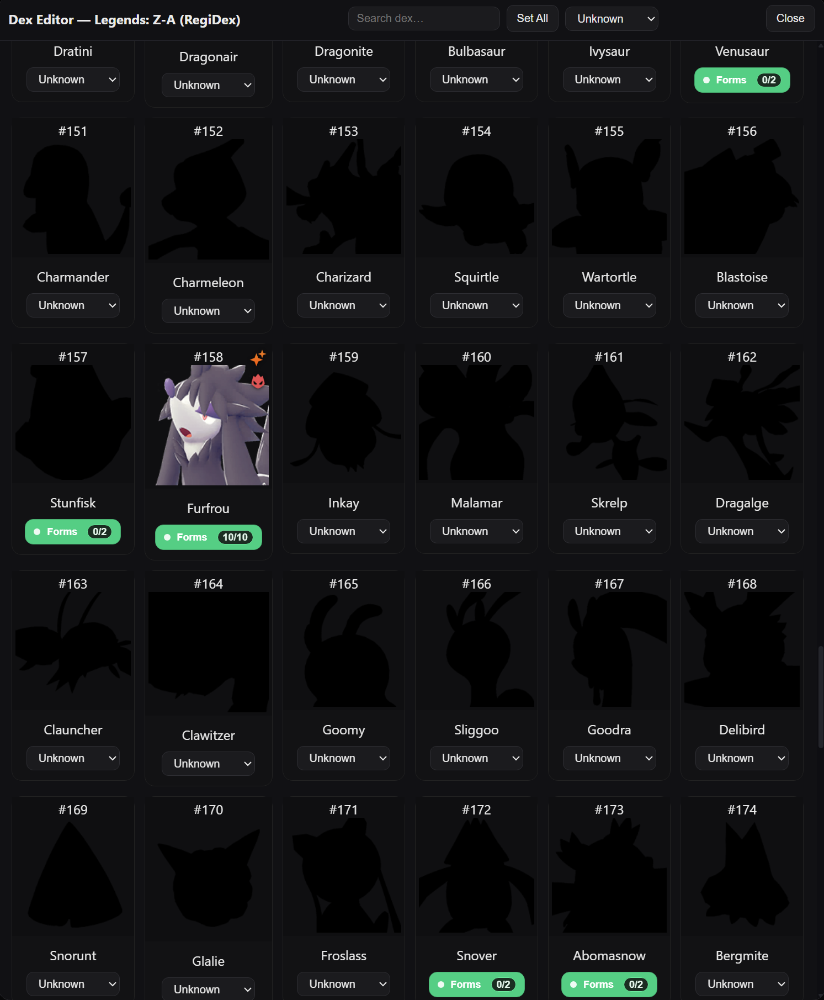
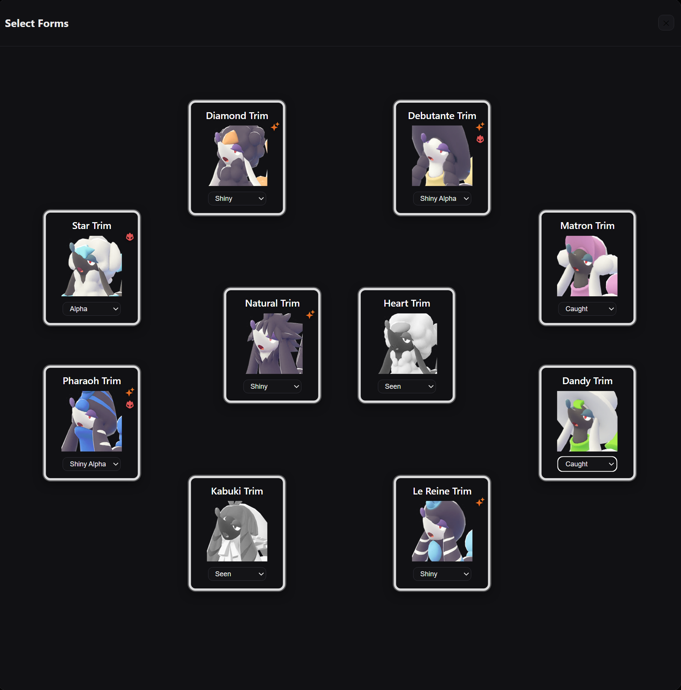
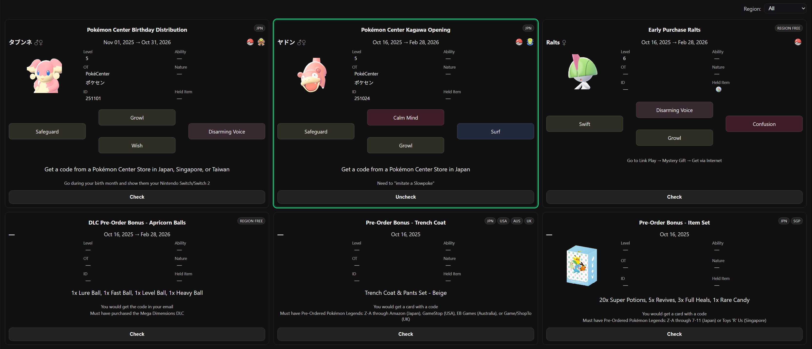
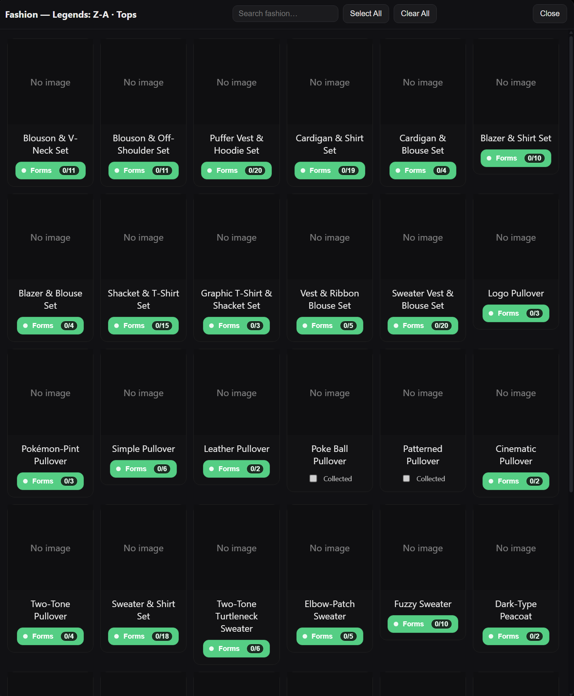
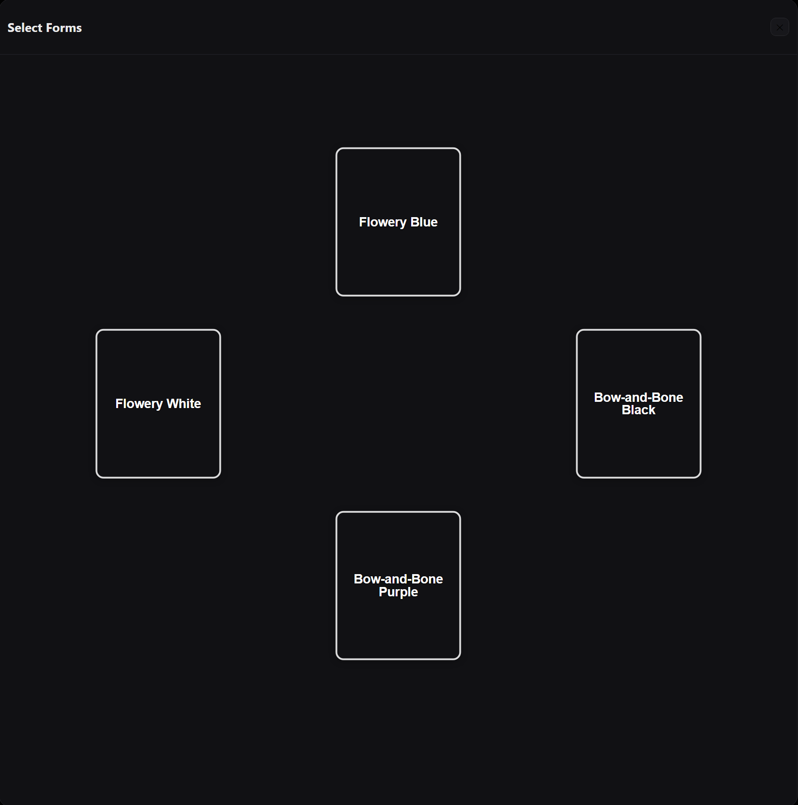

# PokemonPGC

_Pokémon Post-Game Checklist, Dex Tracker, and Data Hub_

> **Unofficial fan project.** Pokémon and all related names/images are trademarks of The Pokémon Company, Nintendo, Game Freak, etc. This is a personal hobby tool with no commercial affiliation.

> **PROJECT IS STILL WIP!!!** I'm currently working to add all data for each game, but the general idea is pretty much done. Commits will be pretty often as I'm adding the data, fixing little bugs I notice, and changing things around. Once all data is added properly, I don't notice any bugs, and I get everything implemented, an official release will be created.

---

## Table of Contents

- [Overview](#overview)
- [Features](#features)
  - [Per-Game Checklists](#per-game-checklists)
  - [Dex Viewer & Forms Layout](#dex-viewer--forms-layout)
  - [Tasks, Sidequests & Research](#tasks-sidequests--research)
  - [Event Distributions](#event-distributions)
  - [Fashion, Recipes & Collectibles](#fashion-recipes--collectibles)
  - [Shiny / Alpha Tracking](#shiny--alpha-tracking)
  - [Dex Sync (Regional ↔ National)](#dex-sync-regional--national)
- [Data Model (High Level)](#data-model-high-level)
- [Tech Stack](#tech-stack)
- [Project Structure](#project-structure)
- [Roadmap / Ideas](#roadmap--ideas)
- [Legal](#legal)

---

## Overview

**PokemonPGC** (Pokémon Post-Game Checklist) is a web app that helps you track virtually everything across your Pokémon games:

- Main story & post-game checklists per game
- Regional & national Pokédex completion
- Forms, gender differences, shiny / alpha variants
- Sidequests, research tasks, trades, gifts, rankings
- Event distributions (with region filters)
- Fashion items, curry/sandwich recipes, and other collectibles

The app is designed to run entirely in the browser (using localStorage) **or** with the built-in API routes for multi-device syncing.

---

## Features

### Per-Game Checklists

- Each supported game has its own tab/section.
- Summary header shows:
  - Completion percentage
  - Visual progress bar
- Tasks can be grouped by:
  - Story / post-game
  - Sidequests / optional content
  - Game-specific systems (Battle Frontier, contests, etc.)
- Supports subtasks, tags, and optional metadata for richer tracking.

### Dex Viewer & Forms Layout

- Regional and national dexes per generation.
- Each dex entry includes:
  - ID, name, regular & shiny sprite paths
  - Optional forms (regional forms, gender forms, etc.)
  - Possible `mythical` flag for Set All
- Form entries are rendered in a **radial/grid layout** inside a modal:
  - Radial view of forms up to 7 forms
  - Grid view of forms with 8 or more forms
  - Automatic card spacing & scaling to avoid clipping
  - Vertical scrolling when there are many forms
- Shiny toggle for switching between regular/shiny display, persisted in state.

### Tasks, Sidequests & Research

- Rich tracking beyond "beat the game":
  - Sidequests, unique encounters, etc.
  - Research/task-based systems (e.g. Legends-style research entries).
  - Trades, gift Pokémon, rankings, and special events.
- Tasks live in data files (plain JS objects) and are fully customizable.

### Event Distributions

- Dedicated **Distributions** view for tracking event Pokémon.
- Each card can define:
  - Event name/description
  - Applicable games
  - Regions (e.g., `North America`, `Europe`, `Japan`, `Region Free`)
  - Shiny / alpha flags
- Region dropdown filter:
  - Shows only distributions for the selected region.
  - `Region Free` events are always visible regardless of filter.
- Cards show region tags and optional shiny/alpha badges.

### Fashion, Recipes & Collectibles

- Separate modules for things like:
  - Fashion items (clothes, accessories, etc.)
  - Curry/sandwich/food recipes
  - Other collectible subsystems per game
- Use similar card+meter patterns:
  - Per-section meter (`X / Y` items collected)
  - Cards arranged in radial rings, with icons and completion toggles.

### Shiny / Alpha Tracking

- Dex entries store both `img` (regular) and `imgS` (shiny).
- Global shiny-mode toggle affects how sprites are rendered.
- Distributions and other modules can show shiny/alpha badges for relevant content.

### Dex Sync (Regional ↔ National)

- Dex entries can define `dexSync` links, e.g.:
  ```js
  dexSync: [
    { game: "ruby", dexType: "regional", id: 201 },
    { game: "ruby", dexType: "national", id: 385 },
  ];
  ```
- Allows cross-linking between regional and national dex entries.
- Makes it easier to keep completion consistent across dex views.

---

## Data Model (High Level)

The project is heavily data-driven. Basically all content is defined in JS data files.

**Checklist Tasks**

```js
{
	id: "legendsza-catching-2",
	text: "Obtain all In-Game Gift Pokémon",
	done: false,
	children: [
		...,
		...,
		{
			id: "legendsza-catching-2-i",
			text: "AZ's Floette",
			done: false,
			img: _assetPath("sprites/gen9/legendsza/base-icons/670-e.png"),
			taskSync: ["legendsza-story-2-a", "legendsza-mega-stones-26"],
			dexSync: [{ game: "legendsza", dexType: "regional", id: 39, form: "Eternal Flower" }],
		},
	],
}
```



```js
{
	id: "legendsza-upgrades-1-a",
	text: "Red Canari Plush",
	img: _assetPath("items/gen9/legendsza/redcanariplushlv.3.png"),
	type: "tiered",
	tiers: [3, 5, 8],
	currentTier: 0,
	currentCount: 0,
	unit: "caught",
	tooltip: "Increase EXP Points gained.\nTier thresholds are 3, 5, and 8 Colorful Screws.",
},
```



**Dex Entries**

```js
{
	id: 158,
	name: "Furfrou",
	img: _assetPath("sprites/gen9/legendsza/base-icons/676.png"),
	imgS: _assetPath("sprites/gen9/legendsza/shiny-icons/676.png"),
	forms: [
		{
			name: "Natural Trim",
			img: _assetPath("sprites/gen9/legendsza/base-icons/676.png"),
			imgS: _assetPath("sprites/gen9/legendsza/shiny-icons/676.png"),
		},
		...,
		{
			name: "Pharaoh Trim",
			img: _assetPath("sprites/gen9/legendsza/base-icons/676-ph.png"),
			imgS: _assetPath("sprites/gen9/legendsza/shiny-icons/676-ph.png"),
		},
		],
},
```




**Distributions**

```js
...,
{
	id: 5,
	eventTitle: "Early Purchase Ralts",
	region: "Region Free",
	name: "Ralts",
	image: _assetPath("sprites/gen9/legendsza/base-icons/280.png"),
	gender: "female",
	"start-date": "2025-10-16",
	"end-date": "2026-02-28",
	ball: { name: "Cherish Ball", img: _assetPath("balls/gen9/legendsza/pokeball.png") },
	level: 6,
	tid: "",
	heldItem: [
		{ name: "Gardevoirite", img: _assetPath("mega_stones/gardevoirite.png") },
	],
	moves: [
		{ name: "Disarming Voice", img: "", type: "Fairy" },
		{ name: "Confusion", img: "", type: "Psychic" },
		{ name: "Growl", img: "", type: "Normal" },
		{ name: "Swift", img: "", type: "Normal" },
	],
	extra: ["Go to Link Play → Mystery Gift → Get via Internet"],
},
...,
```



**Fashion / Collectibles**

```js
{
	id: "cardigan-and-blouse",
	name: "Cardigan & Blouse Set",
	forms: [
		{ id: "cardigan-and-blouse-1", name: "Flowery White" },
		{ id: "cardigan-and-blouse-2", name: "Flowery Blue" },
		{ id: "cardigan-and-blouse-3", name: "Bow-and-Bone Black" },
		{ id: "cardigan-and-blouse-4", name: "Bow-and-Bone Purple" },
	],
},
```




---

## Tech Stack

**Frontend**

- **Vite** + **React 18** app shell.
- A hybrid frontend made up of:
  - React components for the main app shell, routing, sidebar, content views, and newer modals
  - Existing vanilla JS modules that still power parts of the runtime, store, task rendering, and modal systems
- Plain CSS stylesheets plus React-driven UI composition

**API / Sync Layer (Optional)**

- **Node.js API routes** under `frontend/api`.
- **Prisma** ORM with a relational database backend.
- Provides:
  - Account system (sign up / login)
  - Progress backup & restore via `/progress` and other endpoints

The frontend works fully standalone, but connecting the backend enables multi-device sync and more robust backups.

---

## Project Structure

Current high-level structure:

```text
PokemonPGC/
  	frontend/
		index.html               	# Vite HTML entry
		vite.config.js				# Vite config + /api proxy behavior
		api.js						# Frontend API helpers
		data/						# Per-game data and registries
			data.js               	# Initialization for titles / tabs / games
			bootstraps/...			# Generation and game bootstrap wiring
			distributions/...		# Internet / serial-code / IRL event data
			fashion/...				# Collectible fashion data
			layouts/...				# Layout definitions for sections and tasks
			mon_info/...			# Pokemon info data files
			natidexs/...			# National dex data
			regidexs/...			# Regional dex data
			tasks/...				# Checklist sections and tasks
		fonts/...					# Pokemon themed fonts for possible use
		src/
			App.jsx
			main.jsx				# React entry point
			components/...			# React shell, sidebar, content, and modal components
			hooks/...				# React hooks
			modals/...				# Dex, model viewer, and modal logic
			react-bridge/...		# Bridge layer into legacy runtime/state
			runtime/...				# Runtime globals / UI globals
			ui/...					# Existing UI helpers still in use
			index.js
			persistence.js
			progress.js
			registry.js
			store.js
			tasks.js
		styles/...					# CSS styling
		api/
			auth/...
			progress/...
			save-import/...
			_lib/...                # Shared API helpers
		prisma/
			schema.prisma
		scripts/
			api-dev-server.mjs      # Local adapter for /api during Vite dev
			write-dist-env.mjs      # Writes runtime env values into dist output
```

This is currently a hybrid React + legacy-runtime codebase. React now owns the main app shell and more of the UI surface, while the older modules still provide a lot of the task, persistence, modal, and store behavior.

---

## Roadmap / Ideas

These are not guaranteed, but are on the conceptual wishlist:

- Pull more Pokemon species/form/info data from PokeAPI instead of hardcoding everything by hand
- Add manual input/info sections for things that do not fit neatly into dex or checklist flows
- Expand the model viewer into a more complete feature instead of just a side utility
- Walkthroughs, guides, and other helpful in-app reference material
- Better connections between tasks, dex entries, collectibles, and Pokemon info pages
- Save-file parsing:
  - Upload `.sav` / `.bin` / `main` files.
  - Decode hex values to auto-fill dex, tasks, and event flags (per-game, format-dependent).
- Aggregated global stats once a usebase is established.
- Descriptive tooltips for locations/guides

---
## Legal

- This is an **unofficial fan-made project**.
- Pokémon, Pokémon character/location names, and sprites are trademarks of their respective owners.
- Use of official assets is intended for personal, non-commercial, and educational purposes.
- If you fork or host your own instance, it's your responsibility to follow the policies of Nintendo, Game Freak, The Pokémon Company, and any asset providers.
